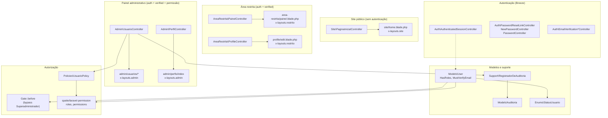

# Diagrama — Arquitetura Atual (Fundação)

## Notas

- O namespace `App\Http\Controllers\Api\V1` existe reservado, mas ainda não tem rotas nem controllers — ver `docs/API-FUTURA.md`.
- Módulos futuros (Tesouraria, Secretaria, Chancelaria, CMS completo, Notícias, Eventos, Documentos, Mural, Galeria) ainda não têm representação neste diagrama — serão adicionados incrementalmente conforme forem implementados.
